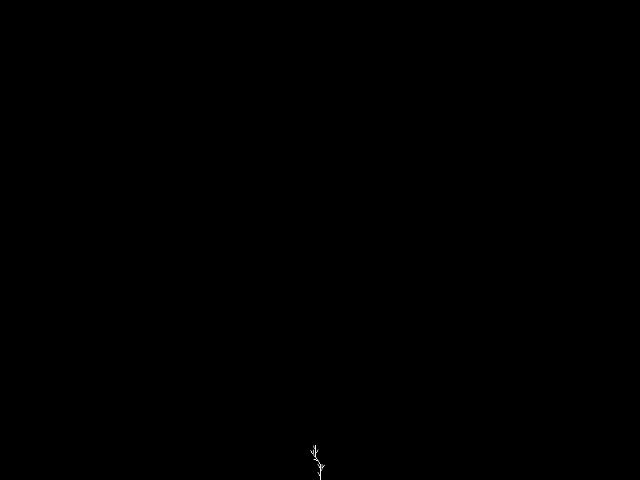

# Lindenmayer System

A simple SDL2 + C++ program that animates tree-like **L-systems** using turtle graphics.

<p align="center">
  
</p>

## Compile

```bash
g++ LindenmayerSystem.cpp -std=c++17 -O2 `sdl2-config --cflags --libs` -o LindenmayerSystem
```

## Run

```bash
# Normal interactive mode
./LindenmayerSystem
```

```bash
# FFmpeg capture mode (GIF)
./LindenmayerSystem ffmpeg | ffmpeg -f rawvideo -pixel_format rgba -video_size 800x600 -framerate 60 -i - LindenmayerSystem.gif
```
